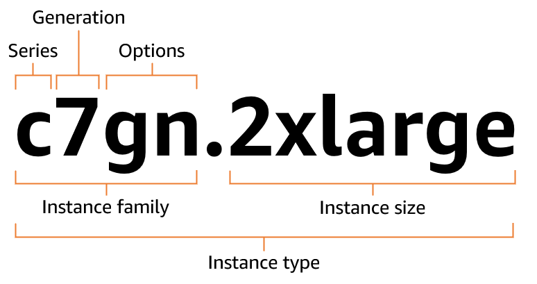
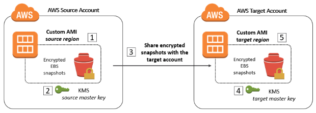

# 3.1 EC2 Fundamentals — Instance Types & AMIs

---

## Core Concept

Cloud ကိုမသုံးခင် က Application တစ်ခု host ချင်ရင် Physical Server တစ်လုံး ဝယ်ရတယ်၊ Data Center မှာ Rack တပ်၊ Network ချိတ်ရတယ်။ ဒါပြီးမှ Software install လုပ်ပြီး run နိုင်တာ။ CloudComputing က ဒီ pattern ကို ပြောင်းပစ်တယ်။ Server ကို ဝယ်မဆောင်ဘဲ **လိုသလောက် ငှားပြီး မလိုရင်ပြန်ဖြုတ်နိုင်**တဲ့ Model ကို ပေးလိုက်တာ။ AWS မှာ ဒီ "Virtual Server ငှားရမ်းတဲ့" service ကို **EC2** လို့ ခေါ်ပါတယ်။

---

## EC2 အကြောင်း အခြေခံသဘောတရား

**EC2** ဆိုတာ **Elastic Compute Cloud** ကို အတိုကောက်ခေါ်တာဖြစ်တယ် **IaaS (Infrastructure as a Service)** model ဖြစ်ပါတယ်။ EC2 ကနေ ဘာတွေ ရနိုင်လဲဆိုတာ ၄ ချက်နဲ့ ခြုံငုံပြောလို့ရပါတယ်:

```
Virtual Machine ငှားနိုင်တယ်                 → EC2
Virtual Drive ပေါ်မှာ Data သိမ်းနိုင်တယ်       → EBS
Load ကို Machine တွေဆီ ဖြန့်ချနိုင်တယ်         → ELB
Auto Scaling Group နဲ့ Scale လုပ်နိုင်တယ်     → ASG
```

**မှတ်ထားရမယ့် အချက်တွေ:**
- EC2 ဟာ **Regional Service** ဖြစ်တယ်။ IAM လို Global မဟုတ်ဘဲ Region တိုင်းမှာ သီးခြားရှိတယ်
- OS ကိုယ်တိုင် ရွေးနိုင်တယ်။ Linux, Windows, macOS (macOS ကတော့ Dedicated Hardware ပေါ်မှာပဲသုံးလို့ရတယ်။ အခုတော့ မသုံးဖူးသေးဘူး။)
- Instance တွေကို Stop, Start, Terminate လုပ်နိုင်တယ်
- VPC ထဲက Public/Private Subnet မှာ run ကြပြီး ENI (Elastic Network Interface) ကနေ Network connected လုပ်ပြီးသုံးကြတာပေါ့။

---

## EC2 Configuration Options

Instance တစ်ခု launch မလုပ်ခင် ဒီ parameter တွေကို သုံးပြီး ကျွန်တော်တို့က တည်ဆောက်ရပါတယ်:

```
OS (Operating System)  → Linux, Windows, macOS
CPU                    → vCPU အရေအတွက်
RAM                    → Memory ဘယ်လောက် သုံးမှာလဲ
Storage                → Network-attached: EBS / EFS
                          Hardware-attached: Instance Store (ephemeral)
Network Card           → Speed, Public IP
Security Group         → Basic Firewall rules
User Data              → First boot မှာ run မယ့် Script (root user အနေနဲ့ run တယ်။ ပထမဆုံး boot တက်တဲ့ အချိန်မှာပဲ run တာကို မှတ်ထားရမယ်)
```

---

## Instance Naming Convention

AWS က သူ့ရဲ့ Instance တွေကို စနစ်တကျနဲ့ သေချာ တည်ဆောက်ထားတယ်။
Instance name တစ်ခုကို မြင်ရင် ချက်ချင်း ဒီ Instance အမျိုးအစားကိုခွဲခြားတတ်ဖို့ ဒီ pattern ကို သိထားဖို့လိုပါတယ်။

```
m  5  .  2xlarge
│  │        └── Size: nano → micro → small → medium → large → xlarge → 2xlarge → ...
│  └────────── Generation: ဂဏန်းကြီးလေ Hardware သစ်လေ
└───────────── Family: Hardware optimization ကို ဆုံးဖြတ်တယ်
```

ဥပမာ `c5.xlarge` ဆိုရင် — `c` က Compute Optimized family၊ `5` က 5th generation၊ `xlarge` က size ပါ။



---

## EC2 Instance Families

ကျွန်တော်တို့က Workload အမျိုးအစားအပေါ် မူတည်ပြီး Instance Family ကို ရွေးချယ်ရတယ်။ မှားရွေးမိရင် ပိုက်ဆံကုန်ပြီး Performance လည်း ကျနိုင်တာကြောင့် ဒီ Family တွေကို သေချာ နားလည်ဖို့ လိုပါတယ်။

### 1. General Purpose — t, m

scenario မရှိဘဲ "ဘာ workload မှန်းမသိ" ဆိုတဲ့ အချိန်မျိုး ဒီ family ကို ရွေးပါ — CPU, Memory, Network ၃ မျိုးစလုံး မျှတနေတဲ့ instance အမျိုးအစားတွေဖြစ်ပါတယ်။

```
Use Cases : Web servers, code repositories, small-medium databases,
            dev/test environments
Balance   : CPU = Memory = Network (balanced)
Examples  : t2.micro, t3.medium, m5.large, m6g.xlarge
Free Tier : t2.micro (750 hours/month)
```

---

### 2. Compute Optimized — c

Compute Optimized ဆိုတာ CPU ratio ကို memory ထက် အများကြီး ပိုများထားတဲ့ instance အမျိုးအစားဖြစ်ပါတယ်။ Calculation အများကြီး တစ်ချိန်တည်း run ဖို့ အဓိကထားပြီးသုံးကြပါတယ်။

```
Use Cases : Batch processing, media transcoding, high-performance web servers,
            HPC (High Performance Computing), scientific modeling,
            ML inference, dedicated gaming servers
Characteristic: CPU performance အမြင့်ဆုံး
Examples  : c5.large, c5n.large, c6g.xlarge
```


---

### 3. Memory Optimized — r, x, z

RAM ကို CPU ထက် အများကြီး ပိုထည့်ထားတဲ့ instance မျိုးပေါ့ Data အများကြီးကို Memory ထဲမှာ တင်ပြီး မြန်မြန် process လုပ်ဖို့ အဓိကထားပြီးသုံးကြပါတယ်။

```
Use Cases : High-performance relational/non-relational databases,
            in-memory databases (Redis, Memcached),
            distributed web-scale cache stores,
            real-time processing of big unstructured data,
            Business Intelligence (BI) workloads
Characteristic: RAM ratio မြင့်မားတယ်
Examples  : r5.large, r6g.xlarge, x1e.xlarge, z1d.large
```

---

### 4. Storage Optimized — i, d, h

High-speed local storage I/O ကို အဓိကထားတဲ့ instance မျိုးပါ သူက Sequential read/write throughput မြင့်မားပြီး IOPS အများကြီး ရနိုင်တယ်။

```
Use Cases : High-frequency OLTP (Online Transaction Processing),
            relational & NoSQL databases,
            data warehousing,
            distributed file systems,
            cache for in-memory databases
Characteristic: Local storage I/O မြင့်မားတယ်၊ tens of thousands of IOPS ရနိုင်
Examples  : i3.large, i3en.xlarge, d2.xlarge, h1.2xlarge
```

---

### 5. Accelerated Computing — p, g, inf, trn, f

GPU / FPGA hardware ပါတဲ့ instance မျိုးပါ — AI/ML training, graphics rendering, video encoding တို့လို GPU-intensive workload တွေအတွက် သုံးလေ့ရှိပါတယ်။

```
Use Cases : ML training, GPU-intensive workloads,
            graphics rendering, video encoding,
            FPGA-based hardware acceleration
Examples  : p3.2xlarge (GPU), g4dn.xlarge (GPU), inf1.xlarge (Inferentia)
```
---

### Family Summary

| Family | Prefix | Best For | Ratio |
|---|---|---|---|
| General Purpose | t, m | Web servers, mixed workloads | Balanced |
| Compute Optimized | c | HPC, batch, gaming | CPU-heavy |
| Memory Optimized | r, x, z | In-memory DBs, BI | RAM-heavy |
| Storage Optimized | i, d, h | High IOPS, OLTP, NoSQL | Storage-heavy |
| Accelerated Computing | p, g, inf | ML training, GPU rendering | GPU/FPGA |

---

## AMI (Amazon Machine Image)

EC2 Instance တစ်ခု launch လုပ်တဲ့အခါ "ဘာ OS, Software, ဘယ်လို Config နဲ့ start မလဲ" ဆိုတာ သတ်မှတ်ပေးတဲ့ Template တစ်ခုကို **AMI** လို့ ခေါ်ပါတယ်။ 

ကျွန်တော်တို့ VMWare မှာဆို VM တစ်လုံးကို စိတ်ကြိုက် Configure လုပ် ပြီးရင် သူ့ကို Snapshot ယူပြီး Template လုပ်ပြီး နောက် ထပ် VM တွေမှာ တူညီတဲ့ Config ကို အကြိမ်ကြိမ် သုံးကြသလိုမျိုးပေါ့။

ဒီ Image ကနေ Instance တွေ တစ်ပြိုင်တည်း ဘယ်လောက်မဆို launch လုပ်နိုင်ပါတယ်။ မူရင်းကောင်းရင် မိတ္တူကောင်းပါတယ်။

AMI ကြောင့် Software pre-packaged ဖြစ်နေတဲ့အတွက် **Boot/Configuration time မြန်ကြောင်းနဲ့ Instance တွေကြားမှာ Consistency ရှိ**ပါတယ်။

**မှတ်ထားရမယ့် rule:** AMI ဟာ **Region-specific** ဖြစ်တယ် Region တစ်ခု မှာ create လုပ်ထားတဲ့ AMI ကို တစ်ခြား Region မှာ တိုက်ရိုက် launch လုပ်လို့မရဘဲ **Copy ပြီးမှ** launch လုပ်နိုင်တယ်။

### AMI Types ၃ မျိုး

```
1. Public AMI       → AWS ကပဲ provide လုပ်တဲ့ AMI အမျိုးအစားပေါ့
                      (Amazon Linux 2, Ubuntu, Windows Server)

2. Custom AMI       → ကိုယ်တိုင် build ပြီး maintain လုပ်တဲ့ AMI
                      (ကိုယ့် software, config, monitoring tool တွေ ထည့်ထားတဲ့ Image)
                      Golden AMI pattern လို့ခေါ်လေ့ရှိတယ် standard image တစ်ခုကနေ Instances အကုန် spawn တာမျိုးပေါ့။ ကိုယ့်စိတ်ကြိုက် သေချာ build ပြီးမှ သုံးတာမျိုးပေါ့၊ သုံးလေ့လဲ ရှိကြပါတယ်။

3. Marketplace AMI  → Third-party vendor တွေက ရောင်းတဲ့/ပေးတဲ့ AMIတွေပေါ့
                      (ဥပမာ — Palo Alto Firewall, Cisco router AMI)
                      သူတို့ကို ကိုယ်က ပိုက်ဆံ ပေးရတာမျိုးတွေရှိတယ်။
```

### Custom AMI Build Process

Custom AMI Image တစ်ခုကို ဘယ်လိုတည်ဆောက်ကြမလဲ။
```
Step 1: EC2 Instance တစ်ခု launch ပြီး customize လုပ်
         (software install, config ချ, security hardening)
Step 2: Instance ကို Stop (data integrity အတွက် running state မှာ create လုပ်တာမကောင်းဘူး)
Step 3: Actions → Create Image → AMI create 
Step 4: ဒီ AMI ကနေ Instance အသစ်တွေ ပြန်ပြီး launch လို့လို့ရသွားပြီပေါ့။ 
```

### AMI Sharing & Copying Rules

```
Unencrypted AMI:
  ✓ Other AWS Account တွေနဲ့ share လုပ်နိုင်တယ်
  ✓ Publicly share လုပ်နိုင်တယ်
  ✓ Region ပြောင်း copy လုပ်ရင် Encryption ထည့်နိုင်တယ်
  ✓ Encryption key ပြောင်းနိုင်တယ်

Encrypted AMI:
  ✓ Customer managed KMS key သုံးထားမှ other account နဲ့ share လုပ်လို့ရတယ်။
  ✗ Publicly share မလုပ်နိုင်ဘူး
  ✓ Region ပြောင်း copy လုပ်ရင် encryption key ပြောင်းနိုင်တယ်

Cross-account Encrypted AMI share ဖို့ requirements:
  1. AMI ကို Target account နဲ့ share + Launch Permission ထည့်
  2. KMS Key ကို Target account / IAM Role နဲ့ share
  3. Target account IAM မှာ DescribeKey, ReEncrypt*, CreateGrant, Decrypt permission ရှိဖို့ လို
  4. Target က ကိုယ့် KMS key နဲ့ re-encrypt ပြုလုပ်ပြီး launch လုပ်နိုင်တယ်
```

---

## EC2 User Data & Metadata

### User Data

Instance **ပထမဆုံး boot** ဖြစ်တဲ့ အချိန်မှာ **တစ်ကြိမ်တည်း** run မယ့် Script ဖြစ်ပါတယ်။ software install, config update, file download စတာတွေကို instance ဆောက်ပြီးမှ လုပ်မယ့်အစား boot တက်တဲ့ အချိန်မှာ automate လုပ်လိုက်တဲ့ သဘောမျိုးပေါ့။

```bash
#!/bin/bash
yum update -y
yum install -y httpd
systemctl start httpd
systemctl enable httpd
echo "Hello from EC2" > /var/www/html/index.html
```

မှတ်ထားရမယ့် behavior:
- **Root user** အနေနဲ့ run တယ်
- **Reboot** ဖြစ်ရင် ထပ် run **မှာမဟုတ်တော့ဘူး**
- **Stop → Start** cycle ဖြစ်ရင် new boot cycle ဖြစ်တဲ့အတွက် **ထပ် run တယ်**

### Instance Metadata

Instance ထဲကနေပဲ ကိုယ်ရဲ့ Instance ID, IP, IAM Role name စတာတွေ query လုပ်လို့ရတဲ့ endpoint ပါ။ ဒါကတော့ knowledge အနေနဲ့ပြောပြတာပါ။

```
URL: http://169.254.169.254/latest/meta-data/

Paths:
http://169.254.169.254/latest/meta-data/instance-id
http://169.254.169.254/latest/meta-data/local-ipv4
http://169.254.169.254/latest/meta-data/public-ipv4
http://169.254.169.254/latest/meta-data/iam/info
```
---

## IP Address Types

IP Address အမျိုးအစားလေးတွေကိုလဲ OverView အနေနဲ့ ဒီနေရာမှာပြောပြချင်ပါတယ်။ အခုပြောနေတာက IP Address အကြောင်းပါ။ VPC အခန်းရောက်ရင် ပြောပြမယ့် Public/Private Subnet တွေနဲ့တော့ မရောစေချင်ပါဘူး။


| Type | Stop ဖြစ်ရင် | ရွှေ့နိုင်လား | Cost |
|---|---|---|---|
| Public IP | အသစ်ပြောင်းသွားတယ် | မရဘူး | Free (attached ဖြစ်နေရင်) |
| Private IP | အမြဲတမ်းရှိနေတယ် | မရဘူး| Free |
| Elastic IP | Static ဖြစ်နေတယ် | Instance/ENI ကြားမှာ ရွှေ့နိုင် | charge ရှိတယ် |

Fixed public IP လိုချင်ရင် Elastic IP သုံးမှရတယ်။ ဒါပေမယ့် Elastic IP ကို unattached ထားရင် charge ကောက်တာဖြစ်တဲ့အတွက် Load Balancer DNS name ကို ပိုသုံးတာ AWS recommended ဖြစ်ပါတယ်။

---

## Placement Groups

Instance တွေကို Physical hardware ပေါ်မှာ ဘယ်လို ထားမလဲဆိုတာ control လုပ်ချင်ရင် Placement Group သုံးတယ်။ ကျွန်တော်တို့တွေ Onpremise Data Center တွေမှာ Server တွေကို ဘယ်ဟာကို တော့ ဘယ်နေရာမှာထားမယ် ဆိုပြီး ဆုံးဖြတ်ကြသလိုပေါ့။

```
Cluster    → Same Rack, Same AZ မှာ instance တွေ စုထားတယ် အဲ့တော့
              → Low latency, High throughput (10 Gbps network) ဖြစ်သွားတယ်
              → တစ်ခုရှိတာက Single AZ = HA မဟုတ်ဘူး အဲ့တော့ rack fail ရင် အကုန် ထိနိုင်တယ်။ Service တစ်ခုလုံး Down သွားနိုင်တယ်။
              → Use case: HPC, tightly-coupled workloads

Spread     → Instance တစ်ခုချင်းစီကို Different Rack, Different AZ မှာ ထားတယ်။ HA ကတော့ တိုးတက်လာပြီပေါ့
              → AZ တစ်ခုမှာ max 7 instance ပဲထားလို့ရတယ်။
              → Use case: Critical instances isolation လုပ်ချင်ရင်

Partition  → Instance Group (Partition) တွေကို Different Rack မှာ ထားတယ်
              → Multi-AZ ထောက်ပံ့ တယ်၊ Partition တစ်ခုမှာ Instances အများကြီး ထည့်လို့ရတယ်။
              → Use case: Hadoop, Cassandra, Kafka (distributed workloads)
```

**Exam Trap:** Cluster Placement Group = Low latency ကောင်းတယ် - High Availability မဟုတ်ဘူး။ "Highly available AND low latency" ဆိုရင် Cluster ပဲ ဖြစ်မဖြစ် မေးပြီး HA ရှိဖို့ Spread/Partition ကို ထည့်စဉ်းစားရမယ်။ ဒါကတော့ စာမေးပွဲထဲမှာ စဥ◌်စားရမခက်ရအောင် Cheat Code ပေးတာပါ။

---

## EC2 Hibernate

Instance ကို Stop မလုပ်ဘဲ "sleep mode" ကြားမှာ ထားနိုင်တဲ့ feature ပါ။ Mac မသုံးဖူးတော့ ပါ/မပါ မသိပေမယ့် Windows မှာတော့ပါပါတယ် xD. RAM ထဲမှာ ရှိနေတဲ့ data ကို Encrypted EBS root volume ပေါ် write ပြီး instance ကို preserve လုပ်ထားတာ။ ပြန် start ဖြစ်ရင် OS restart မလုပ်ဘဲ RAM state ကို restore ပြီး boot မြန်မြန် တက်လာတယ်။

```
Normal Stop → RAM ပျောက်သွားတယ်၊ EBS ကတော့ ကျန်နေတယ်
Terminate   → RAM ပျောက်၊ Root EBS default ဖြစ်ပျက် (deleted)
Hibernate   → RAM → Encrypted EBS မှာ save → fast resume
```
---

## Key Rules to Memorize

ဒါဆို ပြောခဲ့ ရေးခဲ့တာတွေလဲ များပြီဆိုတော့ အနှစ်ချုပ်ကြည့်ရအောင်။

```
✓ EC2 = Regional Service (Global မဟုတ်)
✓ Instance name: [family][gen].[size] → m5.2xlarge
✓ t/m = balanced  |  c = CPU-heavy  |  r/x = RAM-heavy
✓ i/d = IOPS-heavy  |  p/g = GPU/FPGA
✓ AMI = Region-specific — တစ်ခြား Region မှာ သုံးဖို့ Copy လုပ်ရတယ်
✓ User Data = first boot only, root user run
✓ Stop→Start = new boot cycle → User Data ထပ် run တယ်
✓ Reboot = User Data ထပ် run မှာ မဟုတ်ဘူး
✓ Metadata URL = http://169.254.169.254/latest/meta-data/
✓ Public IP = Stop ဖြစ်ရင် ပြောင်းတယ် | Elastic IP = Static
✓ Cluster PG = Low latency + NOT HA (Single AZ)
✓ Spread PG = Max 7/AZ + High isolation
✓ Partition PG = Distributed workloads (Hadoop/Kafka/Cassandra)
```

---
ကဲ ဒါဆိုရင်တော့ ကျွန်တော်တို့ EC2 instance တွေ အတွက် လိုအပ်တဲ့ Storage Service ဖြစ်တဲ့ EBS အကြောင်းကို ဆက်ကြည့်ကြရအောင်။